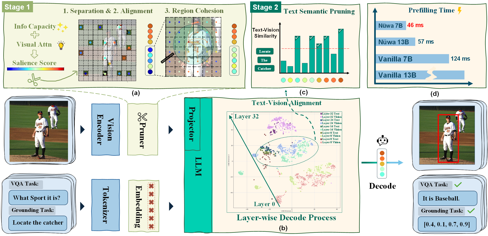
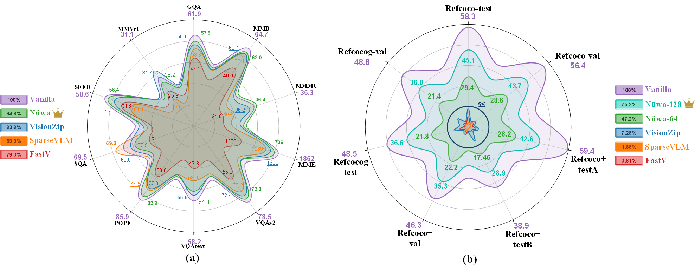

# Nüwa: Mending the Spatial Integrity Torn by VLM Token Pruning
<p align="center" width="100%">

</p>


## TABLE OF CONTENTS
- [Nüwa: Mending the Spatial Integrity Torn by VLM Token Pruning](#nüwa-mending-the-spatial-integrity-torn-by-vlm-token-pruning)
  - [TABLE OF CONTENTS](#table-of-contents)
  - [News](#news)
  - [Highlights](#highlights)
  - [Installation](#installation)
  - [Quick Start](#quick-start)
  - [Evaluation](#evaluation)
  - [Acknowledgement](#acknowledgement)
  - [License](#license)
      
## News

- [x] [2024.11.30] We release the Code of Nüwa.


## Highlights
<p align="center" width="90%">

</p>

1. Nüwa achieves SOTA performance on multiple VQA benchmarks (from 94\% to 95\%) and yields substantial improvements on visual grounding tasks (from 7\% to 47\%). 


## Installation

1. Install the [LLaVA](https://github.com/haotian-liu/LLaVA) and [transformers 4.54.0.dev0](https://github.com/huggingface/transformers.git) environment.

2. Download the repository and running the following command:
```
cd nuwa
pip install -e .
```
3. replace the modeling_llama in transformers by ours [code](./transformers/src/transformers/models/llama/modeling_llama.py), that use for stage-2 pruning
3. For other dependency libraries, refer to [env.yaml](./env.yaml) to ensure compatibility.

## Quick Start
```Python
from llava.model.builder import load_pretrained_model
from llava.mm_utils import get_model_name_from_path
from llava.eval.run_llava import eval_model
from nuwa import nuwa
model_path = "liuhaotian/llava-v1.5-7b"

tokenizer, model, image_processor, context_len = load_pretrained_model(
    model_path=model_path,
    model_base=None,
    model_name=get_model_name_from_path(model_path)
)
## Setting in 64 tokens of LLAVA
model = nuwa(model, matain_token=64, distance=280)
```


## Evaluation
The evaluation code follows the structure of [Lmms-Eval](https://github.com/EvolvingLMMs-Lab/lmms-eval). We provide modified code files based on lmms-eval that can be used to replace the source files for verification purposes.


```python
## Load LLaVA Model (code from llava.eval.model_vqa_loader)
tokenizer, model, image_processor, context_len = load_pretrained_model(model_path, args.model_base, model_name)
## add Nuwa
from nuwa import nuwa
model = nuwa(model, matain_token=64, distance=280)
```

We also provide the bash scripts for evaluation in exp_bash
```
bash exp_bash/llava.sh
```


## Acknowledgement
- This work is built upon [LLaVA](https://llava-vl.github.io/), [transformers](https://github.com/huggingface/transformers), [Lmms-Eval](https://github.com/EvolvingLMMs-Lab/lmms-eval), and [Qwen25-VL](https://github.com/QwenLM/Qwen3-VL). We thank them for their excellent open-source contributions.

- We also thank [StreamingLLM](https://github.com/mit-han-lab/streaming-llm), [FastV](https://github.com/pkunlp-icler/FastV), [SparseVLM](https://github.com/Gumpest/SparseVLMs), [VisionZip](https://github.com/dvlab-research/VisionZip), and others for their contributions, which have provided valuable insights.

## License
- Nüwa is licensed under the Apache License 2.0. 
